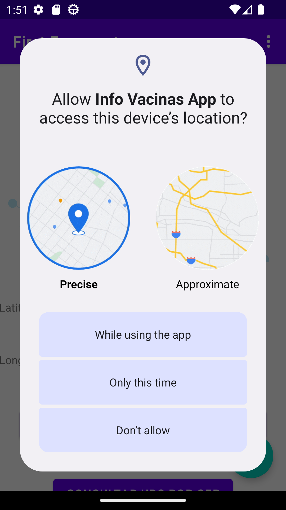
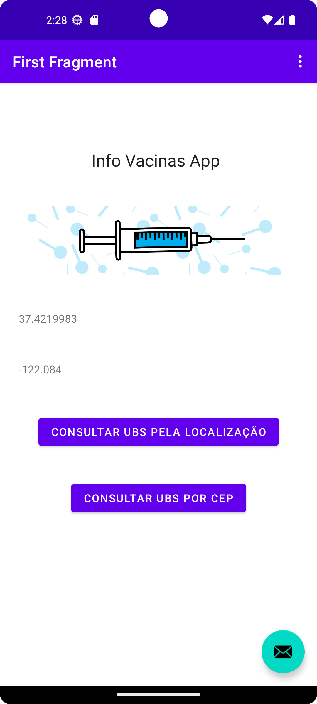
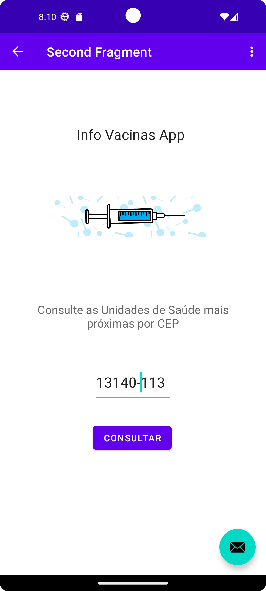
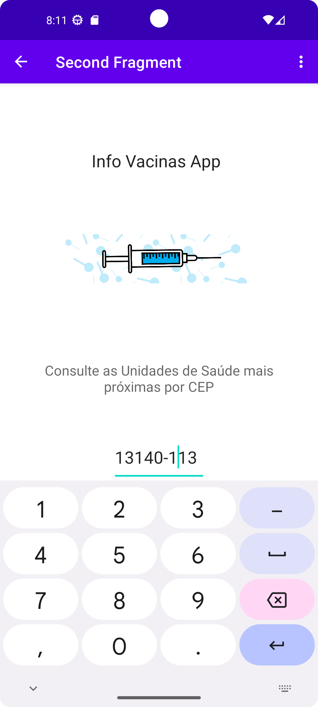

# info_vacinas_app
Info Vacinas App - Aplicativo de vacinas do site https://info-vacinas.herokuapp.com/

## Tela solicitando autorização de localização ao abrir o aplicativo

## Tela inicial da aplicação, após a autorização de acesso à localização

## Tela da consulta por localização, após clicar no botão "Consulta UBS por CEP"

## Tela com formulário da consulta por CEP, demonstrando que trata-se de um campo numérico, habilitando apenas os números do teclado do aparelho

## Resultado da consulta por CEP

## Tela com formulário da consulta por CEP, após clicar no botão "Consulta UBS pela localização"

## Resultado da consulta por localização
